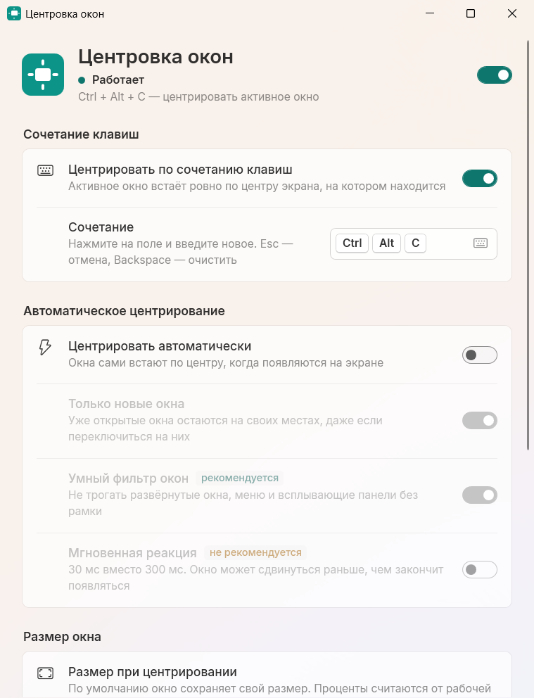

# WinCenter

Маленькая программа для Windows 11, которая ставит окна ровно по центру экрана — по сочетанию клавиш или сама, как только окно появилось.



## Что умеет

- **Ctrl + Alt + C** — активное окно встаёт по центру экрана, на котором находится. Сочетание можно поменять на любое
- Автоматическое центрирование: новые окна сами встают по центру, а уже открытые остаются на своих местах
- Исключения: программы, которые автоматическое центрирование не трогает
- Умный фильтр не трогает развёрнутые окна, меню и всплывающие панели
- Окно плавно доезжает до центра, а не прыгает
- При центрировании может задать окну ширину и высоту в процентах от экрана
- Живёт в трее: пауза, центрирование последнего окна и настройки — правой кнопкой по значку
- Запуск вместе с Windows, проверка обновлений, настройки в стиле Windows 11 со светлой и тёмной темой

## Как запустить

Готовая сборка лежит на странице [релизов](https://github.com/Frezesov/WinCenter/releases). Для неё нужен [.NET Desktop Runtime 10](https://dotnet.microsoft.com/download/dotnet/10.0) (x64).

Собрать самому:

```
dotnet publish -c Release -o dist
```

Запустите `dist\WinCenter.exe`. Чтобы открыть настройки, щёлкните по значку в трее или запустите программу ещё раз.

## Полезно знать

- В сочетании нужна хотя бы одна клавиша-модификатор (Ctrl, Alt, Shift или Win). Без неё можно назначить только F1–F24.
- Сочетание перехватывается, пока WinCenter запущен, даже если его занимает Windows: например, Win + Q будет центрировать окно, а не открывать поиск.
- Когда активно окно программы, запущенной от имени администратора, Windows не даёт обычным программам перехватывать клавиши, и сочетание в нём не сработает.
- Исключения действуют только на автоматическое центрирование: сочетание клавиш и меню в трее центрируют окно любой программы.
- Раз в сутки программа спрашивает у GitHub, вышла ли новая версия, и показывает ссылку на неё. Сама она ничего не скачивает; проверку можно выключить в блоке «О программе».
- Настройки лежат в `settings.json` рядом с программой, а если туда нельзя писать — в `%APPDATA%\WinCenter`.
- Ошибки записываются в `%LOCALAPPDATA%\WinCenter\error.log`.

## Спасибо

Идея и набор функций — [Window Centering Helper](https://kamilszymborski.github.io/) (Kamil Szymborski). Код оригинала закрыт, эта программа написана с нуля. Подробнее в [THIRD-PARTY-NOTICES.txt](THIRD-PARTY-NOTICES.txt).
